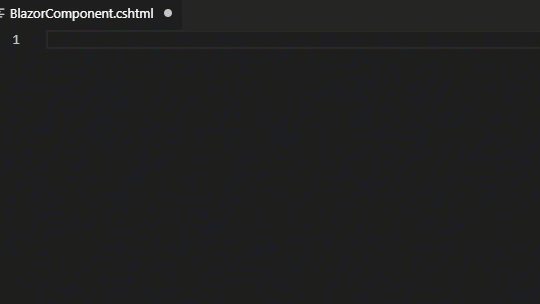
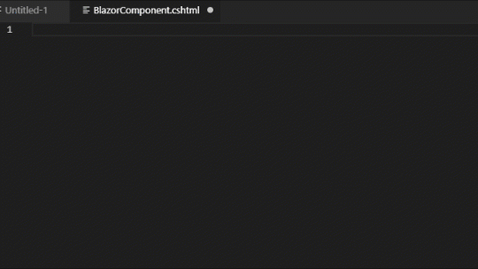

# Blazor Snippets for VS Code
Blazor Snippets for VS Code provides common snippets for writing Blazor apps in VS Code and lets you spend less time writing boilerplate and more time writing your app.

### Note: All Snippets start with a "b" prefix for discoverability purposes.

## Features

- ### Using `bc` to create a blank Blazor Component, `bpara` to create a parameter, `boi` to create OnInitAsync, and `binjhttp` to inject an HttpClient.

    

- ### Using `bchttp` to scaffold out a Blazor Component with an HttpClient call.
    

## Scaffold Blazor Component Snippets
| Snippet                      | Purpose                                                      |
| ---------------------------- | ------------------------------------------------------------ |
| `bc`                         | Create a blank Blazor Component.                             |
| `bchttp`                     | Create a Blazor Component with an HTTP call.                 |
| `bcchild`                    | Create a Blazor Child Component that accepts a parameter.    |

## Scaffold Blazor Razor Snippets
| Snippet                      | Purpose                                                      |
| ---------------------------- | ------------------------------------------------------------ |
| `bfunc`                      | Create a `@functions` block.                                 |
| `bpara`                      | Creates `[Parameter] string Name { get; set; }`.             |
| `bpg`                        | Creates `@page` directive.                                   |
| `bpgr`                       | Creates `@page "/"` with a route.                            |
| `binj`                       | Creates `@inject` directive.                                 |
| `binjhttp`                   | Creates `@inject HttpClient Http`.                           |
| `binh`                       | Creates `@inherits` directive.                               |

## Scaffold Blazor Event Snippets
| Snippet                      | Purpose                                                      |
| ---------------------------- | ------------------------------------------------------------ |
| `boi`                        | Create an `OnInitAsync` event.                               |
| `bois`                       | Create an `OnInit event` (s for synchronous).                |
| `boar`                       | Create an `OnAfterRenderAsync` event.                        |
| `boars`                      | Create an `OnAfterRender` event (s for synchronous)          |
| `bops`                       | Create an `OnParametersSetAsync` event.                      |
| `bopss`                      | Create an `OnParametersSet` event (s for synchronous).       |
| `bsr`                        | Create a `ShouldRender` event.                               |

## Usage
Type part of a snippet, press `tab` and the snippet unfolds.  Continue hitting tab for certan snippets that let you jump to the next cursor location.

## Install
To install - go here and click Install: https://marketplace.visualstudio.com/items?itemName=ScottSauber.blazorsnippets

### For more information

* [GitHub Repository](https://github.com/scottsauber/BlazorSnippets)